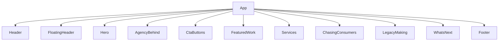

## 1. Stack
- React 18.3.1 + react-dom 18.3.1 (mobile version/package.json)
- Vite 5.4.2 build tool, @vitejs/plugin-react 4.3.1 (mobile version/package.json)
- Tailwind CSS 4.0.0 via @tailwindcss/vite (mobile version/package.json)
- swiper 11.1.14 (carousel/slider lib) (mobile version/package.json)
- Root REPO_ROOT has no package.json — package-lock.json at root is an empty stub; the real app lives entirely under "mobile version/"

## 2. Directory map
| path | what lives there |
|---|---|
| README.md | project readme — scope, setup, deploy instructions |
| package-lock.json | empty root lockfile stub (no root package.json) |
| .github/ | CI workflow — build & deploy to GitHub Pages (per README) |
| mobile version/ | Vite + React app — the actual project (has its own package.json) |
| mobile version/index.html | Vite HTML entry, mounts #root, loads /src/main.jsx |
| mobile version/package.json | app manifest — scripts: dev, build, preview |
| mobile version/vite.config.js | Vite config (out of scope, not read) |
| mobile version/src/ | React source: App.jsx, main.jsx, styles.css, components/ |
| mobile version/src/components/ | 13 .jsx files — homepage section/UI components |
| mobile version/public/ | static assets — fonts/, favicon.ico, logo-n.png, robots.txt |

## 3. Diagram

## 4. Component index
- [[App]]
- [[Header]]
- [[FloatingHeader]]
- [[Hero]]
- [[AgencyBehind]]
- [[CtaButtons]]
- [[FeaturedWork]]
- [[Services]]
- [[ChasingConsumers]]
- [[LegacyMaking]]
- [[WhatsNext]]
- [[Footer]]

## 5. Entry points
- Dev: `cd "mobile version" && npm run dev` (mobile version/package.json scripts.dev = "vite")
- Prod build: `cd "mobile version" && npm run build` (mobile version/package.json scripts.build = "vite build")
- Preview build: `cd "mobile version" && npm run preview` (mobile version/package.json scripts.preview = "vite preview")
- HTML entry: mobile version/index.html → `<script type="module" src="/src/main.jsx">`
- JS entry: mobile version/src/main.jsx → `ReactDOM.createRoot(...).render(<App />)` → mobile version/src/App.jsx

## 6. Conventions
- One component per file under mobile version/src/components/, PascalCase filename matching the default export name (observed: App.jsx imports `Header from "./components/Header.jsx"`, etc.)
- App.jsx composes the page as a flat, non-routed list of imported section components (mobile version/src/App.jsx)
- Shared UI state (`menuOpen`) is owned by App.jsx and passed as props to Header and FloatingHeader (mobile version/src/App.jsx lines 15, 19-20)
- Global stylesheet is imported once, in main.jsx (`import "./styles.css"`), not per-component (mobile version/src/main.jsx)
- React StrictMode is not used — main.jsx calls `ReactDOM.createRoot(...).render(<App />)` directly with no `<React.StrictMode>` wrapper (mobile version/src/main.jsx)

## 7. Where things go
- Add a new homepage section: create mobile version/src/components/NewSection.jsx, then import and render it in mobile version/src/App.jsx
- Change global styles or fonts: edit mobile version/src/styles.css; font files live in mobile version/public/fonts
- Change page title, meta tags, or favicon: edit mobile version/index.html
- Add an npm script or dependency: edit mobile version/package.json (the app's own manifest, not the root package-lock.json)
- Adjust deployed base path: mobile version/vite.config.js `base` value must match the repo name (per README; file not read — out of scope)
